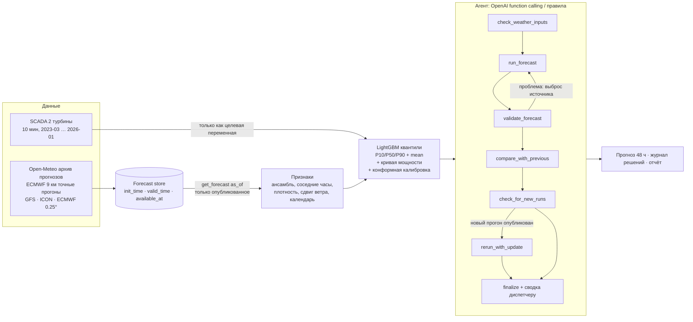

# HackAlem AI — Agentic AI для прогноза выработки ВЭС на 24–48 ч

Агент каждый день в 10:00 (время станции) выпускает **почасовой вероятностный прогноз (P10/P50/P90)**
выработки ВЭС из двух турбин на следующие двое суток. Для прогноза он использует **только архивные погодные прогнозы,
опубликованные к моменту выпуска**. Агент сам проверяет входные данные, запускает ML-модель, проверяет результат,
отбрасывает неисправные источники, **пересчитывает прогноз при выходе нового прогона погодной модели** и пишет сводку
для диспетчера. Каждое решение с объяснением попадает в журнал.

| Итог | Значение |
|---|---|
| Прогноз на тестовый период | **28 выпусков (31.01–27.02.2026) × 48 ч**, станция + T1 + T2 → [`outputs/agent/agent_submission_feb2026.csv`](outputs/agent/agent_submission_feb2026.csv) |
| Точность, репетиция на январе 2026 (модели не видели дек–янв) | **MAE 0.144** на D+1, **0.176** на D+2 (доля номинала), LLM-агент |
| Выигрыш к классическому «NWP + кривая мощности» | **−9% MAE** (holdout дек–янв), **+6%** в среднем за 12 месяцев CV |
| Вклад агента (пересчёт на свежем прогоне, отбраковка источников) | **−11% MAE на D+1** (0.162 → 0.144) к тому же конвейеру без агента |
| Интервал P10–P90 | покрытие **78% / 75%** на D+1 / D+2 (цель 80%) |
| Защита от утечки | правило публикации + тесты + аудит каждого выпуска |

---

## 1. Архитектура



**Полный цикл из ТЗ:** получить внешние погодные данные → подготовить данные → запустить модель → сформировать почасовой прогноз
→ проанализировать результат → пересчитать при обновлении входных данных. Каждый шаг — отдельный инструмент агента
([`src/hackalem/agent/tools.py`](src/hackalem/agent/tools.py)).

## 2. Агент

- **Мозг — LLM (OpenAI, function calling)** ([`agent.py`](src/hackalem/agent/agent.py)). Модель получает не сырые массивы,
  а факты от инструментов: покрытие и свежесть каждого источника, расхождение моделей, итоги валидации, правку к вчерашнему прогнозу,
  появление новых прогонов. Сама решает, что делать дальше. Каждый вызов обязан содержать поле `reason` — объяснение решения.
- **Запасной мозг — правила** (`RuleAgent`) с теми же инструментами. Включается автоматически, если нет `OPENAI_API_KEY`
  или LLM недоступна, поэтому проект всегда воспроизводим.
- **Какие решения принимает агент:**
  - исключает NWP-источник, который сильно отклоняется от медианы ансамбля или имеет пропуски (ECMWF 9 км не трогает, только если он сломан);
  - при сильном расхождении моделей расширяет интервал (ограниченно: он уже откалиброван);
  - **пересчитывает прогноз, когда публикуется более свежий прогон** (обычно ECMWF 00z в 14:00 по времени станции,
    тот же день D, до начала целевых суток) и сообщает, насколько изменился прогноз;
  - проверяет итог: пропуски, границы [0, 1], порядок квантилей, нереальные скачки, согласованность станции и турбин;
  - пишет сводку для диспетчера на русском.
- **Страховка:** агент не может завершиться без прогноза. Если LLM не вызвала `finalize`, срабатывает резервный путь.
- **Журнал решений:** `outputs/agent/logs/<дата>.json` (каждый шаг: инструмент, аргументы, объяснение, результат),
  общий отчёт — [`outputs/agent/AGENT_REPORT.md`](outputs/agent/AGENT_REPORT.md).

Пример (выпуск 11.02.2026, LLM):
```
1 check_weather_inputs  | Проверяю входные данные о погоде для оценки покрытия, свежести и согласованности.
2 run_forecast [-gfs]   | Исключаю модель gfs_seamless, так как она аномальна по сравнению с другими источниками.
3 validate_forecast     | Проверяю прогноз на наличие проблем.
4 compare_with_previous | Сравниваю с предыдущим прогнозом, чтобы выявить значительные изменения.
5 check_for_new_runs    | Проверяю наличие новых прогонов NWP.
6 rerun_with_update     | Обновляю прогноз с новыми прогонами NWP, так как они доступны.
7 finalize              | «Ожидаемая выработка на D+1 (12.02) — 19% от номинала, с периодами штиля…»
```

## 3. Протокол прогноза и защита от утечки

- Выпуск в **день D в 10:00 по времени станции** (= время SCADA = **UTC+6**, установлено по данным, см. ниже),
  прогноз на **локальные сутки D+1 и D+2** (48 часов; заблаговременность 14–61 ч). Первый выпуск — 31.01.2026, последний — 27.02.2026.
  Агент может выпустить обновление в тот же день D после публикации нового прогона.
- **Погода — только архивные прогнозы**, а не реанализ (ERA5) и не факт:
  - **ECMWF IFS 9 км** — точные прогоны как были выпущены (Open-Meteo *Single Runs API*, 00/06/12/18z, с 03.2024);
  - **GFS, ICON, ECMWF 0.25°** — Open-Meteo *Previous Runs API* (значение, спрогнозированное за 1–3 суток).
    Мы проверили сравнением с точными прогонами: `previous_dayN` для часа t — это прогон `floor_6h(t) − N суток`.
- **Правило доступности:** строка прогноза используется в момент `as_of`, только если
  `init_time + задержка_публикации ≤ as_of` (консервативно: ECMWF 8 ч, GFS и ICON 6 ч) — [`weather/store.py`](src/hackalem/weather/store.py).
- **Проверки:**
  - тесты: результат не меняется, если удалить все будущие прогоны; в признаках нет данных SCADA;
  - аудит каждого тестового выпуска с использованными прогонами — [`outputs/forecast/issue_log.csv`](outputs/forecast/issue_log.csv).
- **Обучение на тех же условиях, что и тест:** процедура выпуска воспроизведена на истории (723 выпуска с 03.2024),
  модель учится на прогнозах погоды в том виде, в каком они были доступны в момент выпуска.
- **SCADA не используется как вход** (например, «вчерашняя мощность»): данные организаторов заканчиваются 31.01,
  для февральских выпусков такого признака не было бы.

## 4. Данные и находки

Подробно — [`outputs/eda/EDA.md`](outputs/eda/EDA.md), [`outputs/weather/WEATHER.md`](outputs/weather/WEATHER.md).

- Две турбины в ~350 м друг от друга ведут себя почти одинаково (корреляция 0.997). Цель — средняя станции, плюс отдельные модели T1 и T2.
- Очистка: простои (мощность ≈0 при ветре ≥5 м/с) и ограничения мощности (видны «полки» 0.41/0.61/0.72)
  исключены из обучения, исходная мощность сохранена для оценки.
- **Время SCADA — фиксированное UTC+6**: переход Казахстана на UTC+5 в 03.2024 в данных не отражён.
  Установлено кросс-корреляцией с прогнозами ECMWF. Ошибка в час напрямую испортила бы прогноз.
- Датчик температуры — в гондоле (на 3–5 °C теплее воздуха), поэтому плотность воздуха считается по NWP.
- **Ансамбль 4 моделей лучше любой одной:** MAE ветра на D+1 1.89 против 2.18 м/с у ECMWF 9 км.
  ECMWF занижает ветер на площадке на ~1 м/с, зимой сильнее.

## 5. Модель

[`src/hackalem/models/gbm.py`](src/hackalem/models/gbm.py), отчёт — [`outputs/model/MODEL.md`](outputs/model/MODEL.md).

- **LightGBM, квантильная регрессия P10/P50/P90** и отдельная модель среднего. P50 оптимален для MAE, среднее — для RMSE.
- **73 признака:** по каждой NWP-модели (ветер 10/100 м, порывы, направление, температура, плотность воздуха, сдвиг ветра, заблаговременность),
  статистики ансамбля (среднее, разброс, min/max), соседние часы и значение в середине часа (SCADA — среднее за час,
  NWP — мгновенное значение), календарь и горизонт, **физический признак** — кривая мощности турбины по прогнозу ветра.
- **Конформная калибровка интервала (CQR)** на данных вне выборки.
- Число итераций — по early stopping. Финальные модели обучены на всей истории до 31.01.2026 (`models/`).

## 6. Результаты

Мощность нормализована к номиналу, поэтому MAE = nMAE.

**Базовые прогнозы и модель, holdout декабрь 2025 – январь 2026** (обучение только до 01.12.2025):

| Метод | MAE | RMSE |
|---|---|---|
| Persistence («завтра как сегодня») | 0.377 | 0.492 |
| Климатология (месяц × час) | 0.321 | 0.361 |
| ECMWF + кривая мощности | 0.200 | 0.290 |
| Ансамбль 4 NWP + кривая мощности + калибровка (лучший baseline) | 0.192 | 0.268 |
| **LightGBM квантили** | **0.175** | **0.251** |

**Rolling CV по 12 месяцам (02.2025–01.2026) и абляции:**

| Вариант | MAE | RMSE | Покрытие 80% |
|---|---|---|---|
| **Полная модель** | **0.163** | **0.231** | 79% |
| Без физического признака | 0.162 | 0.231 | 80% |
| Только ECMWF (без ансамбля) | 0.172 | 0.243 | 79% |
| Лучший baseline | 0.173 | — | — |

→ Главный источник выигрыша — **мультимодельный ансамбль NWP**.

**Сквозная репетиция на январе 2026** (весь конвейер по выпускам, модели обучены до 01.12.2025, сравнение с фактом SCADA):

| | MAE D+1 | MAE D+2 | RMSE D+1 | Покрытие 80% D+1 / D+2 |
|---|---|---|---|---|
| Конвейер без агента (выпуск в 10:00) | 0.162 | 0.178 | 0.238 | 73% / 75% |
| Агент на правилах ([отчёт](outputs/agent_rehearsal_rules/AGENT_REPORT.md)) | 0.149 | 0.180 | 0.219 | 81% / 77% |
| **Агент на LLM, OpenAI** ([отчёт](outputs/agent_rehearsal/AGENT_REPORT.md)) | **0.144** | **0.176** | **0.211** | 78% / 75% |

Основной выигрыш агента — **пересчёт после публикации свежего прогона** (00z, в 14:00 того же дня D) и **отбраковка
источника-выброса** (чаще всего GFS). Порог расширения интервала для агента на правилах подобран по этой же репетиции,
поэтому его покрытие немного оптимистично. Остальные решения от январских данных не настраивались.

## 7. Файлы результата

| Файл | Что внутри |
|---|---|
| [`outputs/agent/agent_submission_feb2026.csv`](outputs/agent/agent_submission_feb2026.csv) | **Основной результат:** 672 часа февраля, для каждого часа — самый свежий финальный прогноз агента; `plant/T1/T2 × p50/p10/p90/mean`, дата и время выпуска |
| [`outputs/agent/agent_forecasts.csv`](outputs/agent/agent_forecasts.csv) | Все 28 выпусков агента × 48 ч × 3 объекта (полная история прогнозов по выпускам) |
| [`outputs/forecast/submission_feb2026.csv`](outputs/forecast/submission_feb2026.csv) | Тот же конвейер без агента, строго выпуск в 10:00 |
| [`outputs/forecast/forecasts_all_issues.csv`](outputs/forecast/forecasts_all_issues.csv) | Все выпуски без агента |
| `outputs/agent/logs/*.json`, [`AGENT_REPORT.md`](outputs/agent/AGENT_REPORT.md) | Журнал решений агента и сводки для диспетчера |

Значения — нормализованная мощность (0..1, доля номинала). `p50` — медианный прогноз (для MAE), `mean` — ожидаемое значение (для RMSE).

## 8. Запуск

```bash
git clone https://github.com/BAITC-Hacks/hack-ee3eb0d0-gjigi.git && cd hack-ee3eb0d0-gjigi
python3 -m pip install -r requirements.txt && python3 -m pip install -e .

# (необязательно) LLM-агент: положите свой ключ в .env (файл в .gitignore)
echo 'OPENAI_API_KEY=sk-...' > .env        # модель: OPENAI_MODEL, по умолчанию gpt-4o-mini

make agent        # агент по февралю 2026 → outputs/agent/   (~1 мин на правилах, ~5 мин с LLM)
make rehearsal    # агент на январе 2026 + сравнение с фактом
make forecast     # тот же прогноз без агента → outputs/forecast/
make test         # 12 тестов, в т.ч. на отсутствие утечки
```

**Архив погодных прогнозов (`data/weather/`) и обученные модели (`models/`) лежат в репозитории**, поэтому команды выше
работают без интернета. Полное воспроизведение с нуля: `make all` (скачивание архива ~15 мин, обучение с CV ~20 мин).

| Этап | Команда | Результат |
|---|---|---|
| 0. EDA и очистка | `make eda` | `outputs/eda/` |
| 1. Архив прогнозов погоды | `make weather` | `data/weather/`, `outputs/weather/` |
| 2. Признаки и baselines | `make baselines` | `outputs/baselines/` |
| 3. Модель | `make train` | `models/`, `outputs/model/` |
| 4. Прогноз по выпускам | `make forecast` | `outputs/forecast/` |
| 5. Агент | `make agent` / `make rehearsal` | `outputs/agent/`, `outputs/agent_rehearsal/` |

Python ≥ 3.11. Зависимости: pandas, numpy, scikit-learn, LightGBM, pyarrow, requests, openai, python-dotenv, matplotlib.

## 9. Структура

```
config.yaml                  все параметры: координаты, протокол выпуска, модели NWP, задержки, пороги агента
src/hackalem/
  data/turbines.py           SCADA: загрузка, флаги качества, часовая агрегация
  weather/openmeteo.py       HTTP-клиент (кэш, ограничение частоты, повторы)
  weather/sources.py         Single Runs / Previous Runs → единый формат
  weather/store.py           архив + get_forecast(as_of) без утечки
  weather/issued.py          воспроизведение протокола выпуска на истории
  features/build.py          признаки (только NWP + календарь)
  models/baselines.py        климатология, persistence, кривая мощности, изотоника
  models/gbm.py              квантильный LightGBM + CQR
  evaluation.py              метрики, holdout, rolling CV
  forecast.py                run_issue(): один выпуск прогноза
  agent/tools.py             инструменты агента
  agent/agent.py             LLM-агент (OpenAI) и агент на правилах
scripts/                     run_eda · build_weather_archive · check_weather · run_baselines ·
                             train_model · run_backtest · run_agent
tests/                       12 тестов (данные, утечка, признаки, модель, агент)
```

## 10. Ограничения

- Факта за февраль 2026 в данных нет, поэтому качество оценено на декабре–январе (holdout, репетиция) и 12-месячной CV.
- Задержки публикации NWP заданы консервативно, а не измерены. Реальная доступность может быть раньше, это только в пользу честности.
- В 03–08.2024 в архиве нет части прогонов ECMWF 06/18z. Тогда используется предыдущий опубликованный прогон.
- Простои и ограничения мощности не прогнозируются: модель прогнозирует выработку при исправной работе турбин.

## 11. Потенциал развития

- **Экономический слой для балансирующего рынка (БРЭ).** Штраф за недовыработку против плана выше, чем премия за перевыработку.
  Поэтому оптимальный план подачи — не медиана, а квантиль прогноза q* = c₊ / (c₊ + c₋) (задача газетчика).
  Из опыта работы с реальной ВЭС в Казахстане: при ~40 и ~18 тг/кВт·ч q* ≈ 0.31.
  Квантильный прогноз уже есть, осталось добавить инструмент агента `recommend_bid` с ценами в конфиге.
- **Масштабирование:** координаты, модели NWP и пороги агента — в `config.yaml`. Новая станция = новый конфиг + архив её SCADA.
- Больше источников (ансамбли ECMWF ENS/GEFS для интервалов), учёт плановых ремонтов и ограничений мощности как отдельной модели доступности.
- Живой режим: тот же `run_issue(as_of=now)` по расписанию, агент реагирует на каждый новый прогон.
